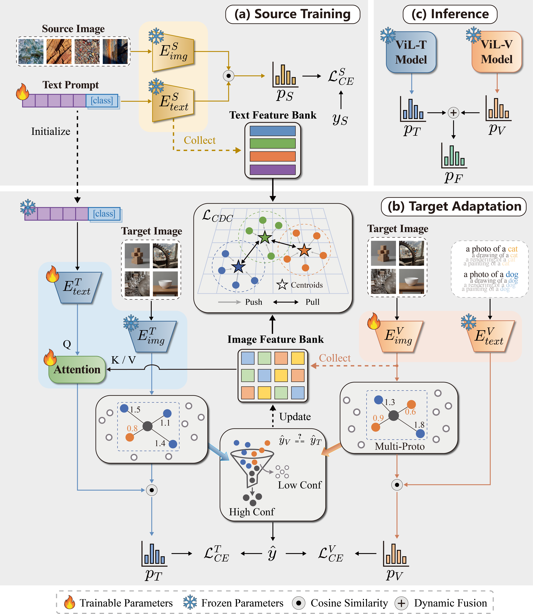

# PCMA: Prompt-guided Cross-domain Multi-prototype Alignment

Official PyTorch implementation of **"Prompt-guided Cross-domain Multi-prototype
Alignment for Source-Free Domain Adaptation"** (ACM ICMR 2026).



PCMA addresses three coupled challenges in CLIP-based source-free domain
adaptation: modality misalignment between text prototypes and visual features,
semantic drift introduced by target-only fine-tuning, and the loss of intra-class
diversity caused by single-prototype heads. It pairs a text branch (ViL-T) that
refines class prototypes with a cross-domain attention block, a vision branch
(ViL-V) that learns adaptive multi-prototype classifier weights, and a
consensus-gated joint optimisation regularised by a cross-domain contrastive
loss.

## Repository layout

```
pcma/
├── adaptive.py                     # Boundary-stress -> per-class K assignment
├── data/office_home.py             # Office-Home dataset and class list
├── losses/cdc.py                   # Cross-Domain Contrastive loss
├── models/
│   ├── source_model.py             # CLIP + learnable context + CA + momentum bank
│   ├── text_branch.py              # ViL-T target branch
│   └── vision_branch.py            # ViL-V target branch
├── modules/
│   ├── cross_attention.py          # Gated cross-domain attention
│   ├── prototype_bank.py           # Momentum-updated class prototypes
│   └── label_propagation.py        # SVD + kNN diffusion + adaptive K splitting
└── utils/                          # Seeds, metrics, scheduler, CLIP templates
tools/
├── train_source.py                 # Source-domain training entry point
└── adapt_target.py                 # Target-domain adaptation entry point
configs/office_home.yaml            # Reference configuration
```

## Installation

```bash
git clone https://github.com/Destiny-Rul/PCMA.git
cd PCMA
conda create -n pcma python=3.10 -y
conda activate pcma
pip install -r requirements.txt
```

The implementation depends on the OpenAI CLIP package and FAISS-GPU. If your
environment cannot install `faiss-gpu`, swap it for `faiss-cpu` and replace the
`StandardGpuResources` / `index_cpu_to_gpu` calls in
`pcma/modules/label_propagation.py` with the CPU index.

## Data preparation

Download Office-Home and organise it as follows:

```
office_home/
├── art/{class_name}/*.jpg
├── clipart/{class_name}/*.jpg
├── product/{class_name}/*.jpg
└── real_world/{class_name}/*.jpg
```

The 65 class names (and their ordering) are defined in
`pcma/data/office_home.py`.

## Usage

### 1. Source-domain training

```bash
python -m tools.train_source \
    --data-root /path/to/office_home \
    --source art \
    --output-dir ./checkpoints/source
```

This learns the context prompt, the cross-domain attention module, and the
momentum-updated visual prototype bank, saving a single checkpoint that the
target stage consumes.

### 2. Target-domain adaptation

```bash
python -m tools.adapt_target \
    --data-root /path/to/office_home \
    --source art --target clipart \
    --source-ckpt ./checkpoints/source/source_art.pth \
    --use-multi-proto
```

Each transfer pair reuses the same source checkpoint; `--use-multi-proto`
turns on the adaptive K mechanism that splits crowded classes into several
sub-prototypes.

## Citation

If you find this work useful, please cite the paper:

```bibtex
@inproceedings{peng2026pcma,
  title     = {{PCMA}: Prompt-guided Cross-domain Multi-prototype Alignment for Source-Free Domain Adaptation},
  author    = {Peng, Kaicheng and Li, Ya},
  booktitle = {Proceedings of the 2026 International Conference on Multimedia Retrieval (ICMR '26)},
  address   = {Amsterdam, Netherlands},
  year      = {2026},
  publisher = {ACM}
}
```

## License

This project is released under the [MIT License](LICENSE).
